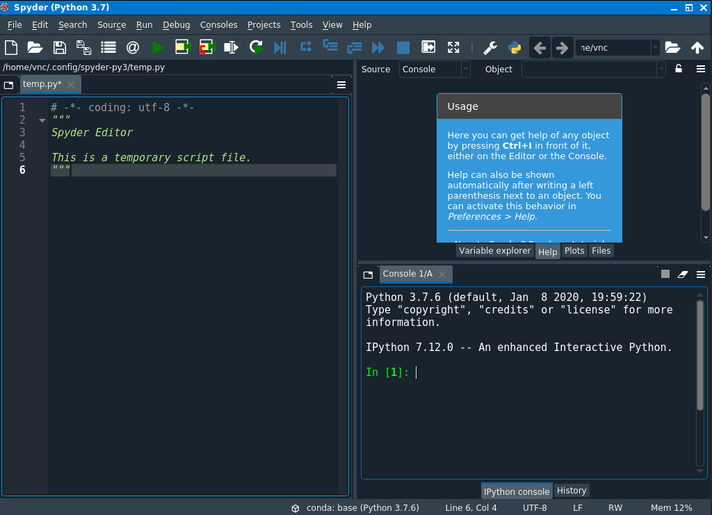

## Python programs are plain text files.

*   They have the `.py` extension to let everyone (including the operating system) 
    know it is a Python program.
    *   This is convention, not a requirement.
*   It's common to write them using a text editor or integrated development environment. We're going to use the Spyder editor that comes with Anaconda.
*   The bit of extra setup is well worth it because Spyder provides code completion     and other helpful features.

## Use Spyder for editing and running Python.

*   The [Anaconda package manager][anaconda] is an automated way to install Spyder.
    *   See [the setup instructions]({{ page.root }}/setup/) for Anaconda installation instructions.
*   It also installs all the extra libraries it needs to run.
*   Once you have installed Anaconda, open a shell and type:

    ~~~
    $ spyder
    ~~~
    {: .bash}
*   Or click on the Spyder icon on your Start menu.

*   This will start a Spyder. 

## Spyder has console and file based running.

*  On the left hand side you'll see a place to write code and save it in a file. 
*  You need to click the play button to run these.
*  On the bottom right is the console. Here you can type in code and have it run immediately.
*  Older versions of Spyder have two consoles. iPython and Python. Newer versions just have iPython, we'll only use that.
*  Files you save can be run outside of Spyder.
*  If you want to run on an HPC this is what you might use.
